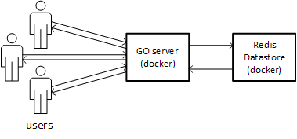

# Short URLs


A simple service written in Go and using Redis to generate short URLs alias to longer ones. Visiting the short URL wille redirect the browser to the long one.

Eg: `http://myhost.com/AzQ02w` will redirect to `https://en.wikipedia.org/wiki/Alan_Turing#Cryptanalysis`


## 1. Overview

This service allows users to create short URLs for longer URLs. These short URLs are of the type `http://myhost.com/AzEr0x`, where the last part, `AzEr0x`, is the __token__ and identifies the short URL. One short URL is identified by a token, and associated to one long URL. This token can be generated randomly or user-defined (given it isn't already used, in which case its last characters is randomly selected).

When visiting `http://myhost.com/AzEr0x`, the browser is redirected through HTTP redirect to the original longer URL provided at the creation of the shorter URL. A short URL is valid 3 months before it is automatically removed from the server

Each time a short url is visited, a counter is incremented on the server to keep track of the number of visits. 

The information about a short url can also be retrieved for monitoring reasons. In that case the URL `http://myhost.com/admin/AzEr0x` will give information on the token: creation time, number of visits, and long url the short url redirects to.

Thus, 3 actions are supported by the server:
- creation of a short URL for a given long URL
- redirection to a long URL when visiting a short URL that was previously created
- monitoring of a short url 

## 1.1 Architecture



The server is Written in GO and is facing the user. Redis is used as datastore to store the data.

## 1.2 Data structure in datastore

Redis is a Key-Value datastore. the Key is a string, and redis supports data structures as Values.
 
 In this program, the Key is the __token__ while the Value is a __map__ containing associated information:
 - `url`: the long URL
 - `creationTime`: the creation time
 - `count`: the number of redirections from this short URL 
  
At each visit the `count` field is incremented by one. 
 
## 1.3 Code structure

```
config/
    - config_loader.go              A file implementing the logic required to load and
                                    process the configuration

handler/
    - create_handler.go             The handler for the requests to create a new short url
    - create_handler_test.go        The tests for the create handler
    - redirect_handler.go           The handler for a request visiting a short url
    - admin_handler.go              The handler for a request to get the information 
                                    on a short url
                                    
mathhelper/
    - mathhelper.go                 A very simple helper file to implmement Math.max(int, int)

urlhelper/
    - urlhelper.go                  A file implementing function to validate a url and
                                    check its reachability
    - urlhelper_test.go             Tests for urlhelper
    
config.yaml                         The configuration file
shorturls.go                        The main logic, entrypoint of the program
```


## 2. API

3 actions are supported by the server, and are descried in this section

### 2.1 create a short URL

a short URL can be created with a `POST` request on the `/shortlink` endpoint. Its body must be a JSON object. The different possible values for this body depend on whether the user submits a custom token to use or not. These possibilities are explained in the following subsections. 

#### 2.1.1 With no suggested token

If the user doesn't require a specific token to be used, a random token of a fixed length (defined in configuration, explained later) is generated by the server.

a `POST` request on the `/shortlink` endpoint with the following headers and body:
```
Content-type: application/json
```
```
{
    "url":  "http://google.com/"
}
```

If the preconditions are met (explained here under), the short url will be created and the reponse will have an HTTP code `201: Created` with a JSON repsonse body containing the short url:
 
```
{
    "url":  "http://myhost.com/Az4rTu"
}
``` 

the creation of a short url is logged at the `info` level.

If the submitted URL doesn't fulfill the preconditions (explained here after), the short URL is not created and a response with an HTTP response code `400: Bad request` will be returned with no body content. In that case the error is logged at the `error` level


#### 2.1.2 With a suggested Token
 
Instead of using a randomly generated token, the user can require its own token to be used, if it has not be used before.

a `POST` request on the `/shortlink` endpoint with the following header and body:
```
Content-Type: application/json
```
```
{
    "url":      "http://google.com/",
    "token":    "choice"
}
```

If this token meets the precondition, a short URL will be created. If the token is already used, its last characters will be replaced by random ones (eg: `choicX`, `choi7D`, `choPc0`...). The server first tries the suggested token, it is used, it replaces its last character with a random one. If after three more generated tokens with one random character still no free token is found, the server uses two random characters at the end of the token, and so on until it finds a free token. The length of the token is always equal to 6 (defined in the conf)

If the generation of the token is successful, the short url will be created and the reponse will have an HTTP code `201: Created` with a JSON repsonse body containing the short url:
 
```
{
    "url":  "http://myhost.com/Az4rTu"
}
``` 

If no token can be generated (no free token could be found in the datastore), a reponse with a code `500` is returned.

If the token doesn't meet the preconditions, a reponse with a code `400: Bad request` will be returned with no body content. In that case the error is logged at the `error` level.

### 2.3 Preconditions

#### 2.3.1 Preconditions on the URL

The preconditions on the submitted URL are the following:
- the URL must be a valid URL
- the URL must be reachable from the server (no intranet url, not .tor URL, ...) 


#### 2.3.1 Preconditions on the suggested Token

The preconditions on the suggested token are the following:
- the suggested token must be only composed of letters and digits (eg: `a`, `B`, `0`)
- the token's length must be of maximum 6 characters (value defined in the config)


### 2.2 visit a short URL

When visiting a short url with a `GET` request on `http://myhost.com/[Tpken}` redirecting to `http://google.com` (as an example here), the server respond with an HTTP code `301: Moved permantantly` and the following header required to redirect the browser:

```
Location:       http://google.com
cache-control:  private, max-age=0, no-cache
```

The `cache-control` header is required so that the client and proxies do not cache the file which would not let the server count the visits.

If the submitted token is not found, a `404: Not found` error is returned.

### 2.3 admin

A `GET` request on `/admin/{Token}` will return the following information in the JSON ody of the reponse:

```
{
    "url":          "http://google.com",
    "creationTime": "1447369814",
    "count":        "4"
}
```

If the submitted token is not found, a `404: Not found` error is returned.


## 3. Configuration

The configuration has to be provided in the `YAML` format in a file named `config.yaml` present in the path from which the go program is executed. The values in this config files are overridden by some environment variables if these variables are set. The configuration is explained in this section.

### 3.1 Config file

The `config.yaml` file contains the following configuration:

```
# general configuration
tokenLength:          6       # the length of the token corresponding to an url
reachTimeoutMs:       2000    # the timeout in ms when checking the reachability of an url
expirationTimeMonths:  3      # number of months before an short url is deleted

# The host and port of the server use for the short URLs returned
host:   localhost               # overridden with $HOST if set
port:   8000                    # overridden with $PORT if set
proto:  http                    # overridden with $PROTO if set

#redis conf
redisHost:      localhost         # overridden with $REDIS_PORT_6379_TCP_ADDR if set
redisPort:      6379              # overridden with $REDIS_PORT_6379_TCP_PORT if set
redisDB:        0                 # overridden with $REDIS_DB if set
redisPassword:                    # overridden with $REDIS_PASSWORD if set
```

The values can be overridden by environment variables as described in the following subsection.

### 3.2 Override conf with environment variables

In order to set configuration specific to the environment (eg: prod, dev, docker container, ...), the configuration can be overridden with the following environment variables:
- `HOST`: the host name to use for the short URLs (eg: `mydomain.com`)
- `PORT`: the port to use for the short URLs eturned (by default `8000`)
- `PROTO`: the potocol to use for the short URLs returned (eg: `htpp`).
- `REDIS_PORT_6379_TCP_PORT`: the redis port (default: `6379`, variable set by the docker links)
- `REDIS_PORT_6379_TCP_ADDR`: the host name to use (eg: `mydomain.com`, set by the docker links)
- `REDIS_PORT_6379_TCP_ADDR`: the address of redis (eg: `213.43.21.56`)
- `REDIS_DB`: the redis DB (default: `0`)
- `REDIS_PASSWORD`: the redis password (default: `empty`)

### 3.3 Log Configuration

Logs can be configured with two environment variables:
- `LOG_LEVEL`: the level to log (`debug`, `info`, `error`, ...)
- `LOG_FILE`: in which file to log (default on docker-compose: `/var/log/shorturls/shorturls.log`, is not set, log reverts to `Stderr`)

When the service is started with docker-compose (explained bellow), the logs are available in the folder `./volumes/log/shorturls.log`.

## 4. Deployment

The service can be easily deployed as two docker containers:
- Go service
- Redis datastore.

Since the Go service require to communicate with Redis, it is linked to the Redis container, which sets the `REDIS_PORT_6379_TCP_PORT` and `REDIS_PORT_6379_TCP_ADDR` environment variables used by the Go service.

### 4.1 Build and Run the containers

__to start the service, two steps are necessary:__

1. `docker-compose build`: build the docker container (the Go service is built from source inside its container, the configuration is automatically copied)
2. `docker-compose up -d`: starts the containers as a deamon.

### 4.1 Log and Data Volumes

In order to persist Redis data and to be able to acces the service log, two folders are monted as volumes from the containers, they are mounted in `./volumes`

The log from the service is accessible in `./volumes/log/shorturls.log` by default.

### 4.1 Stop the containers

`docker-compose stop` will stop the container


